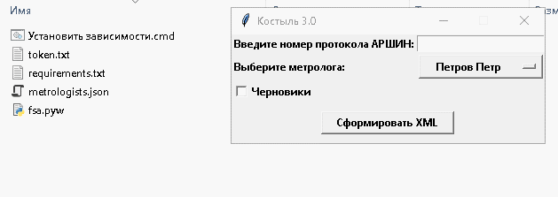

# Костыль 3.0
Скрипт предназначен для выгрузки данных о поверках из ФГИС АРШИН и формирования XML-файлов, для последующей пакетной загрузки данных в систему РА. Используется внешний публичный интерфейс ФГИС АРШИН, что позволяет упросить процесс выгрузки данных.

## Классическая установка

1. [Установите Python версии 3](https://www.python.org/downloads/) (обязательно установить галочку Add Python to PATH).
2. Скачайте скрипт из репозитория.
3. Запустите bat-файл 'Установить зависимости.cmd' для установки python-пакетов.
4. В личном кабинете АРШИН создайте токен.
5. В конфигурационном файле 'token.txt' пропишите токен.
6. В файле 'metrologists.json' пропишите список поверителей и их СНИЛСы.

## Установка без Python

1. Скачайте в разделе релизов [версию упакованную в исполняемый EXE файл "EXE.version.zip"](https://github.com/Xekep/FSA-3.0/releases/latest).
2. В личном кабинете АРШИН создайте токен.
3. В конфигурационном файле 'token.txt' пропишите токен.
4. В файле 'metrologists.json' пропишите список поверителей и СНИЛСы.

## Использование
Алгоритм работы со скриптом представляет собой следующую последовательность действий:

1. Ввести номер протокола из ФГИС АРШИН, который необходимо выгрузить.
2. Выбрать поверителя из выпадающего списка, который будет указан в выходных XML-файлах.
3. Нажать кнопку "Сформировать XML".
5. Выбрать директорию для сохранения файлов.
6. Дождаться окончания работы скрипта и выгрузить полученные XML-файлы в РА.

Если в протоколе больше 500 записей, то результат разбивается на несколько XML файлов.

## Лицензия
Данный скрипт распространяется под лицензией DWTFYWWI. Подробную информацию можно найти в файле LICENSE.
