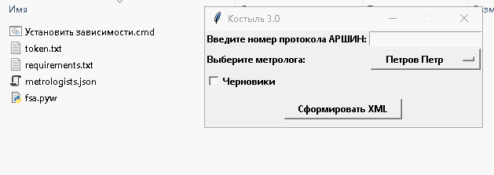

# Костыль 3.0
Скрипт предназначен для выгрузки данных о поверках из ФГИС АРШИН и формирования XML-файлов для последующей пакетной загрузки данных в систему РА.

Для получения протокола заявки используется интерфейс личного кабинета Аршина, а сведения о поверках загружаются через официальный публичный интерфейс `/fundmetrology/eapi/vri/{id}`.

## Классическая установка

1. [Установите Python версии 3](https://www.python.org/downloads/) (обязательно установить галочку Add Python to PATH).
2. Скачайте скрипт из репозитория.
3. Запустите bat-файл 'Установить зависимости.cmd' для установки python-пакетов.
4. В личном кабинете АРШИН создайте токен.
5. В конфигурационном файле 'token.txt' пропишите токен.
6. В файле 'metrologists.json' пропишите список поверителей и их СНИЛСы.

## Установка без Python

1. Скачайте в разделе релизов [версию упакованную в исполняемый EXE файл "EXE.version.zip"](https://github.com/Xekep/FSA-3.0/releases/latest).
2. В личном кабинете АРШИН создайте токен.
3. В конфигурационном файле 'token.txt' пропишите токен.
4. В файле 'metrologists.json' пропишите список поверителей и их СНИЛСы.

## Использование
Алгоритм работы со скриптом представляет собой следующую последовательность действий:

1. Ввести номер протокола из ФГИС АРШИН, который необходимо выгрузить.
2. Выбрать поверителя из выпадающего списка, который будет указан в выходных XML-файлах.
3. Нажать кнопку "Сформировать XML".
4. Выбрать директорию для сохранения файлов.
5. Дождаться окончания работы скрипта и выгрузить полученные XML-файлы в РА.

Скорость обращений к публичному API ограничивается автоматически с запасом ниже лимита Аршина в 2 запроса в секунду. Для временных сетевых ошибок, HTTP 429 и ошибок 5xx выполняются повторные попытки.

Если запись поверки была модифицирована, скрипт переходит к следующей версии записи и не формирует XML по устаревшим сведениям. Аннулированные записи пропускаются.

Поддерживаются сведения о единичном СИ, СИ в качестве эталона и партии СИ (`singleMI`, `etaMI`, `partyMI`).

Если в протоколе больше 500 записей, результат разбивается на несколько XML-файлов.

## Ссылки

1. [Вопросы по работе с ФГИС РА](https://support.fsa.gov.ru/)
2. [РСТ Метрология - справочная информация](https://fgis.gost.ru/fundmetrology/cm/docs?lk=1)

## Лицензия
Данный скрипт распространяется под лицензией DWTFYWWI. Подробную информацию можно найти в файле LICENSE.
